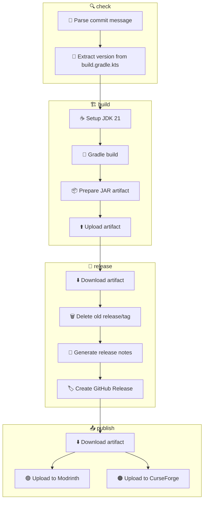

# Build & Release & Publish Workflow

> **[📖 English](build.md)**
> **[📖 中文](build.zh-cn.md)**

## 📋 Overview

The CI/CD pipeline is driven entirely by **commit message keywords**. Push to `main` or `for-*` branches with the right keyword and GitHub Actions takes care of the rest.

## 🔑 Keywords

| Keyword in commit message | Build (Gradle JAR) | GitHub Release | Modrinth | CurseForge |
|---------------------------|:---:|:---:|:---:|:---:|
| `build action` | ✅ | ❌ | ❌ | ❌ |
| `build release` | ✅ | ✅ | ❌ | ❌ |
| `build publish` | ✅ | ✅ | ✅ | ✅ |

> **Note:** Pull Requests always trigger a build (no release or publish). Commit message keywords are **ignored** for PRs — the workflow unconditionally sets `should_build=true`, `should_release=false`, `should_publish=false` and skips keyword parsing entirely.

## 🚀 Usage Examples

```bash
# ============================================================
# Single keyword
# ============================================================

# Just build, verify compilation
git commit -m "ci: test compile (build action)"

# Build + create GitHub Release (no Modrinth/CurseForge publish)
git commit -m "release: v0.3.0 (build release)"

# Full pipeline: build + release + publish to Modrinth & CurseForge
git commit -m "release: v0.3.0 (build publish)"

# ============================================================
# Regular commits (no build, no publish)
# ============================================================

# Just update documentation
git commit -m "docs: update README"

# Fix a bug
git commit -m "fix: resolve team color detection issue"

# Add a new feature
git commit -m "feat: add configurable permissions"
```

## 🏗️ Build Target (Gradle JAR)

| Platform | Build Output | Notes |
|----------|:---:|-------|
| Spigot / Paper 1.21.5 | `qwq-flytre-bingo-booster-<version>.jar` | Fat JAR with Shadow plugin, Kotlin 2.1.10, Gradle 8.8 |

## 📦 Pipeline Stages

```
check ──→ build ──→ release ──→ publish
  │         │         │           │
  │         │         │           ├─ Modrinth: Upload JAR
  │         │         │           │  Requires MODRINTH_TOKEN
  │         │         │           │
  │         │         │           └─ CurseForge: Upload JAR
  │         │         │              Requires CURSEFORGE_TOKEN
  │         │         │
  │         │         └─ Download artifact
  │         │            Delete old release/tag
  │         │            Generate release notes from template
  │         │            Create GitHub Release
  │         │
  │         └─ Build with Gradle (JDK 21)
  │            Upload build artifact
  │
  └─→ Parse commit message
     Extract version from build.gradle.kts
     Determine build/release/publish flags
```

> **Note:** Release notes are auto-generated from `.github/release_template.md` with a changelog collected from git commits since the previous tag.



## 📦 Publish to Modrinth

The `build publish` keyword triggers automatic upload to [Modrinth](https://modrinth.com).

1. Locates the built JAR artifact
2. Uploads via [RubixDev/modrinth-upload](https://github.com/marketplace/actions/upload-to-modrinth) action
3. Tags: `1.21.5` game version, `paper` + `spigot` loaders

### Prerequisites

| Secret | Where to get | Purpose |
|--------|--------------|---------|
| `MODRINTH_TOKEN` | [Modrinth Settings → API Tokens](https://modrinth.com/settings/pats) | Authenticate uploads to Modrinth |
| `MODRINTH_PROJECT_ID` | Your Modrinth project's dashboard → "Edit" → URL path segment (e.g. `abCdEfGh`) | Identifies which project to upload to |

> **Create a token:**
> 1. Go to [modrinth.com/settings/api-tokens](https://modrinth.com/settings/api-tokens)
> 2. Click "New Token"
> 3. Name it (e.g. `github-actions`)
> 4. Scope: `Upload Versions`
> 5. Copy the token and add it as a repository secret named `MODRINTH_TOKEN`

> **Find your Project ID:**
> 1. Go to your Modrinth project page
> 2. Look at the URL: `https://modrinth.com/plugin/abcdefgh`
> 3. The `abcdefgh` part is your project ID — add it as `MODRINTH_PROJECT_ID`

## 📦 Publish to CurseForge

The `build publish` keyword also triggers automatic upload to [CurseForge](https://curseforge.com).

1. Locates the built JAR artifact
2. Uploads via [itsmeow/curseforge-upload](https://github.com/marketplace/actions/upload-to-curseforge) action
3. Tags: `1.21.5` game version, `release` type

### Prerequisites

| Secret | Where to get | Purpose |
|--------|--------------|---------|
| `CURSEFORGE_TOKEN` | [CurseForge Settings → API Keys](https://legacy.curseforge.com/account/api-tokens) | Authenticate uploads to CurseForge |
| `CURSEFORGE_PROJECT_ID` | Your CurseForge project's dashboard → "My Projects" → URL path segment | Identifies which project to upload to |

> **Create a token:**
> 1. Go to [console.curseforge.com](https://console.curseforge.com/?#/api-keys)
> 2. Click "Create API Key"
> 3. Name it (e.g. `github-actions`)
> 4. Copy the key and add it as a repository secret named `CURSEFORGE_TOKEN`

> **Find your Project ID:**
> 1. Go to your CurseForge project page
> 2. The project ID is usually a numeric string visible in the dashboard URL
> 3. Add it as `CURSEFORGE_PROJECT_ID`

## 📌 Version

The version is automatically extracted from `build.gradle.kts` using `grep` and used for:
- Release tag name (e.g. `v0.3.3-beta.1`)
- JAR artifact filename (e.g. `qwq-flytre-bingo-booster-v0.3.3-beta.1.jar`)
- Modrinth version number
- CurseForge version number

## ⚙️ Prerequisites Summary

| Secret | Where to get | Purpose |
|--------|--------------|---------|
| `MODRINTH_TOKEN` | [Modrinth API Tokens](https://modrinth.com/settings/api-tokens) | Upload to Modrinth |
| `MODRINTH_PROJECT_ID` | Your Modrinth project URL | Identify Modrinth project |
| `CURSEFORGE_TOKEN` | [CurseForge Console API Keys](https://console.curseforge.com/?#/api-keys) | Upload to CurseForge |
| `CURSEFORGE_PROJECT_ID` | Your CurseForge project dashboard | Identify CurseForge project |
