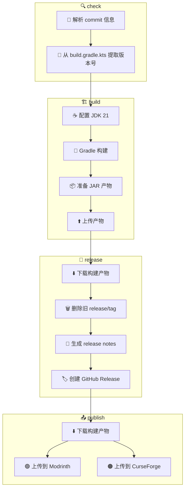

# 构建 · 发布 · 上架工作流

> **[📖 English](build.md)**
> **[📖 中文](build.zh-cn.md)**

## 📋 概述

CI/CD 流水线完全由 **commit 信息中的关键词** 驱动。推送到 `main` 或 `for-*` 分支时，只需在 commit message 中包含对应关键词，GitHub Actions 会自动完成后续工作。

## 🔑 关键词

| Commit 信息中的关键词 | 构建 (Gradle JAR) | GitHub Release | Modrinth | CurseForge |
|----------------------|:---:|:---:|:---:|:---:|
| `build action` | ✅ | ❌ | ❌ | ❌ |
| `build release` | ✅ | ✅ | ❌ | ❌ |
| `build publish` | ✅ | ✅ | ✅ | ✅ |

> **说明:** Pull Request 始终会触发构建（不会发布或上架）。PR 中 commit message 的关键词会被**忽略**——工作流会无条件设置 `should_build=true`、`should_release=false`、`should_publish=false`，并跳过关键词解析。

## 🚀 用法示例

```bash
# ============================================================
# 单个关键词
# ============================================================

# 仅构建，验证编译
git commit -m "ci: test compile (build action)"

# 构建 + 创建 GitHub Release（不上架 Modrinth/CurseForge）
git commit -m "release: v0.3.0 (build release)"

# 完整流水线：构建 + Release + 上架 Modrinth & CurseForge
git commit -m "release: v0.3.0 (build publish)"

# ============================================================
# 常规 commit（不需要构建和发布）
# ============================================================

# 仅更新文档
git commit -m "docs: update README"

# 修复 bug
git commit -m "fix: resolve team color detection issue"

# 添加新功能
git commit -m "feat: add configurable permissions"
```

## 🏗️ 构建产物 (Gradle JAR)

| 平台 | 输出文件 | 说明 |
|------|:---:|------|
| Spigot / Paper 1.21.5 | `qwq-flytre-bingo-booster-<版本号>.jar` | Shadow 插件打包的 Fat JAR，Kotlin 2.1.10，Gradle 8.8 |

## 📦 流水线阶段

```
check ──→ build ──→ release ──→ publish
  │         │         │           │
  │         │         │           ├─ Modrinth: 上传 JAR
  │         │         │           │  需要 MODRINTH_TOKEN
  │         │         │           │
  │         │         │           └─ CurseForge: 上传 JAR
  │         │         │              需要 CURSEFORGE_TOKEN
  │         │         │
  │         │         └─ 下载构建产物
  │         │            删除旧的 release/tag
  │         │            从模板生成 release notes
  │         │            创建 GitHub Release
  │         │
  │         └─ 用 Gradle 构建（JDK 21）
  │            上传构建产物
  │
  └─→ 解析 commit 信息
     从 build.gradle.kts 提取版本号
     确定 build/release/publish 标志
```

> **说明:** Release Notes 自动从 `.github/release_template.md` 生成，变更日志来自上一个 tag 至今的 git commits。



## 📦 上架 Modrinth

`build publish` 关键词会自动将 JAR 上传到 [Modrinth](https://modrinth.com)。

1. 定位构建好的 JAR 产物
2. 通过 [modrinth/upload](https://github.com/marketplace/actions/modrinth-upload) Action 上传
3. 标签: `1.21.5` 游戏版本，`paper` + `spigot` 加载器

### 前置条件

| 密钥 | 获取方式 | 用途 |
|------|----------|------|
| `MODRINTH_TOKEN` | [Modrinth 设置 → API Tokens](https://modrinth.com/settings/pats) | 认证 Modrinth 上传 |
| `MODRINTH_PROJECT_ID` | Modrinth 项目后台 → "Edit" → URL 路径（如 `abCdEfGh`） | 标识要上传的项目 |

> **创建 Token:**
> 1. 打开 [modrinth.com/settings/api-tokens](https://modrinth.com/settings/api-tokens)
> 2. 点击 "New Token"
> 3. 命名（如 `github-actions`）
> 4. 权限范围: `Upload Versions`
> 5. 复制 Token，添加到仓库 Secrets，命名为 `MODRINTH_TOKEN`

> **查找 Project ID:**
> 1. 打开你的 Modrinth 项目页面
> 2. URL 格式: `https://modrinth.com/plugin/abcdefgh`
> 3. `abcdefgh` 就是你的 Project ID — 添加到 Secrets，命名为 `MODRINTH_PROJECT_ID`

## 📦 上架 CurseForge

`build publish` 关键词也会自动将 JAR 上传到 [CurseForge](https://curseforge.com)。

1. 定位构建好的 JAR 产物
2. 通过 [filunderscore/curseforge-upload](https://github.com/marketplace/actions/curseforge-upload) Action 上传
3. 标签: `1.21.5` 游戏版本，`release` 类型

### 前置条件

| 密钥 | 获取方式 | 用途 |
|------|----------|------|
| `CURSEFORGE_TOKEN` | [CurseForge 控制台 → API Keys](https://console.curseforge.com/?#/api-keys) | 认证 CurseForge 上传 |
| `CURSEFORGE_PROJECT_ID` | CurseForge 项目后台 → "My Projects" → URL 中的数字 ID | 标识要上传的项目 |

> **创建 Token:**
> 1. 打开 [console.curseforge.com](https://console.curseforge.com/?#/api-keys)
> 2. 点击 "Create API Key"
> 3. 命名（如 `github-actions`）
> 4. 复制 Key，添加到仓库 Secrets，命名为 `CURSEFORGE_TOKEN`

> **查找 Project ID:**
> 1. 打开你的 CurseForge 项目页面
> 2. Project ID 通常是 URL 中的数字串
> 3. 添加到 Secrets，命名为 `CURSEFORGE_PROJECT_ID`

## 📌 版本号

版本号自动从 `build.gradle.kts` 中提取（通过 `grep`），用于：
- Release 标签名（如 `v0.3.3-beta.1`）
- JAR 产物文件名（如 `qwq-flytre-bingo-booster-v0.3.3-beta.1.jar`）
- Modrinth 版本号
- CurseForge 版本号

## ⚙️ 前置条件汇总

| 密钥 | 获取方式 | 用途 |
|------|----------|------|
| `MODRINTH_TOKEN` | [Modrinth API Tokens](https://modrinth.com/settings/api-tokens) | 上传到 Modrinth |
| `MODRINTH_PROJECT_ID` | Modrinth 项目 URL | 标识 Modrinth 项目 |
| `CURSEFORGE_TOKEN` | [CurseForge 控制台 API Keys](https://console.curseforge.com/?#/api-keys) | 上传到 CurseForge |
| `CURSEFORGE_PROJECT_ID` | CurseForge 项目后台 | 标识 CurseForge 项目 |
