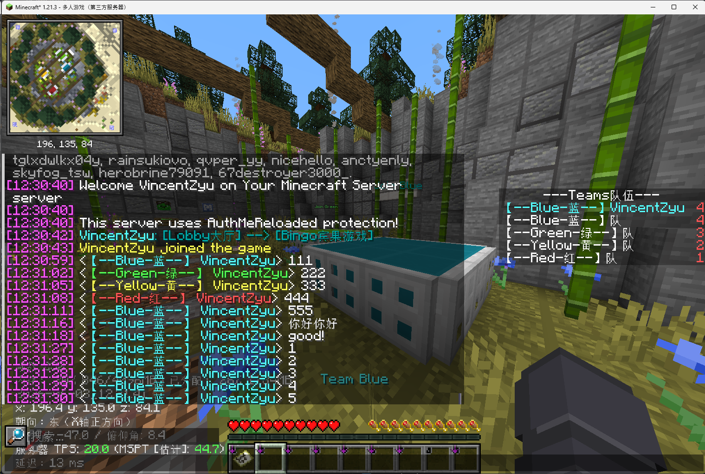

> **[📖 English](README.md)**
> **[📖 中文](README-zh.cn.md)**

# 🎯👥🎨📊⚡ qwq-flytre-bingo-booster

> 🧩 A Spigot helper plugin for [Flytre Bingo](https://www.flytre.net/bingo): team dyeing + sidebar display

[](https://github.com/VincentZyu233/qwq-flytre-bingo-booster)
[](https://gitee.com/vincent-zyu/qwq-flytre-bingo-booster)

[](https://papermc.io)
[](https://www.spigotmc.org/)

[](https://kotlinlang.org)
[](https://gradle.org)

[](https://qm.qq.com/q/4vjto4V7Di)

<p><del>💬 Plugin usage / 🐛 Bug reports / 👨‍💻 Development discussion — Join our QQ Group: <b>259248174</b> 🎉 (This group is gone)</del></p>
<p>💬 Plugin usage / 🐛 Bug reports / 👨‍💻 Development discussion — Join our QQ Group: <b>1085190201</b> 🎉</p>
<p>💡 Mention me in the group for faster replies ~ ✨</p>

---

## 🌟 Features

> 💾 All three commands support persistence to the config file.

| Feature | Command | Description |
|------|------|------|
| 🎨 **Team Dyeing** | `/qwq_bingo_team_color_dye <true/false>` | Reads the native Team or scoreboard objective based on `team_detection` config, applies team color and prefix (🔴Red/🟡Yellow/🟢Green/🔵Blue) to player names |
| 📊 **Sidebar** | `/qwq_bingo_sidebar <true/false>` | Displays team member list on the right side of the screen, auto-refreshes by configurable tick interval |
| 💊 **Persistent Effects** | `/qwq_bingo_effect <true/false> <effect> <amplifier> <true/false>` | Continuously reapplies potion effects to all online players |

> 💡 This plugin is designed specifically for [Flytre Bingo](https://www.flytre.net/bingo). [Download the Flytre Bingo map here](https://www.flytre.net/bingo).
> It reads Minecraft native Teams or the main scoreboard objective to determine teams, integrating with the map's native datapack.

### 🖼️ Preview



### 🗺️ Version Support

> As of June 3, 2026, this plugin supports:

| | |
|---|---|
| 🎯 **Supported Map** | [](https://www.flytre.net/bingo) |
| 🌎 **Map Versions** | 1.16.x · 1.17.x · 1.18.x · 1.19.x · 1.20.2-4 · **1.21.5** · **1.21.10** |
| 📦 **Plugin Version** | [](https://fill-ui.papermc.io/projects/paper/family/1.21) [](https://getbukkit.org/download/spigot) |

---

## 🛠 Tech Stack

| | |
|---|---|
| 🧱 **Server** | [](https://getbukkit.org/download/spigot) |
| 📝 **Language** | [](https://kotlinlang.org) |
| 🏗 **Build** | [](https://gradle.org) |

---

## 📦 Download & Installation

[](https://github.com/VincentZyu233/qwq-flytre-bingo-booster/releases)

Place the `.jar` file in your server's `plugins/` directory and restart.

Default configuration:

```yml
# 🎯 qwq-flytre-bingo-booster 配置

# 📢 日志级别 (Log Level): debug, info, warn, error, silent
# 🐛 debug  - 输出所有日志（调试用 🔧）
# ℹ️  info   - 输出 info 及以上（默认 ✅）
# ⚠️  warn   - 只输出警告和错误 🟡
# ❌ error  - 只输出错误 🔴
# 🔇 silent - 关闭所有日志 🤫
log_level: info

# 🧾 命令名配置
# `team_color_dye` - 开关队伍染色，为玩家名添加对应队伍颜色与前缀
# `bingo_sidebar`  - 开关右侧队伍成员侧边栏显示
# `bingo_effect`   - 设置或关闭常驻药水效果
commands:
  team_color_dye: qwq_bingo_team_color_dye
  bingo_sidebar: qwq_bingo_sidebar
  bingo_effect: qwq_bingo_effect

# 🚀 功能默认启用配置
features:
  team_color_dye:
    enabled_on_load: true
    refresh_interval_ticks: 10
  bingo_sidebar:
    enabled_on_load: true
    refresh_interval_ticks: 10
  bingo_effect:
    enabled_on_load: true
    refresh_interval_ticks: 10
    apply_duration_ticks: 30

# 💊 Bingo 常驻药水效果列表
# 每个对象表示一条受插件管理的常驻药水效果配置
# `enabled`         - 是否启用该效果
# `type`            - 药水效果 ID，例如 minecraft:night_vision
# `amplifier`       - Bukkit 内部等级值，0=1级，1=2级，2=3级，以此类推
# `hide_particles`  - 是否隐藏粒子效果
bingo_effects:
  # 默认效果：急迫 4，隐藏粒子，默认启用
  - enabled: true
    type: minecraft:fast_digging
    amplifier: 3
    hide_particles: true
  # 默认效果：迅捷 3，隐藏粒子，默认启用
  - enabled: true
    type: minecraft:speed
    amplifier: 2
    hide_particles: true
  # 默认效果：夜视 2，隐藏粒子，默认启用
  - enabled: true
    type: minecraft:night_vision
    amplifier: 1
    hide_particles: true

# 👥 队伍检测配置
team_detection:
  # 🔍 检测方式: team 或 scoreboard
  # team       - 优先读玩家当前 scoreboard 上的原生 team，读不到时回退主 scoreboard（推荐 ✅）
  # scoreboard - 读主计分板某个 objective 的分数值
  method: team
  # 📊 如果用 scoreboard 方式，指定主计分板 objective 名
  scoreboard_name: teamScore
```

`commands` — custom command names:

- `team_color_dye`: command name for team dye toggle
- `bingo_sidebar`: command name for bingo sidebar toggle
- `bingo_effect`: command name for persistent potion effect toggle/update

`features.*.enabled_on_load` controls whether features auto-enable on load, and `refresh_interval_ticks` controls each scheduled task interval:

- `true`: auto-enable on server start
- `false`: keep disabled until command is run

`team_detection.method` supports two modes:

- `team`: read the player's native Team from their current scoreboard first, fall back to the main scoreboard
- `scoreboard`: read the score value from the specified objective on the main scoreboard, defaults to `teamScore`

---

## 🔧 Build

### Local Build

```bash
./gradlew build
```

Output is in `build/libs/` (`*-all.jar` is the fat jar).

### GitHub Actions CI

[](https://github.com/VincentZyu233/qwq-flytre-bingo-booster/actions)


Pushing to `main` or `for-*` branches will trigger CI if the commit message contains specific keywords:

| Keyword | Action |
|--------|------|
| `build action` | 🏗 Build and upload artifact |
| `build release` | 🏗 Build + 🚀 Create GitHub Release |

Example:

```bash
git commit -m "aaa: some commit messages...; build action"
git commit -m "bbb: yet other commit messages...; build release"
```

PRs to `main` or `for-*` branches also trigger builds (but not releases).

---
